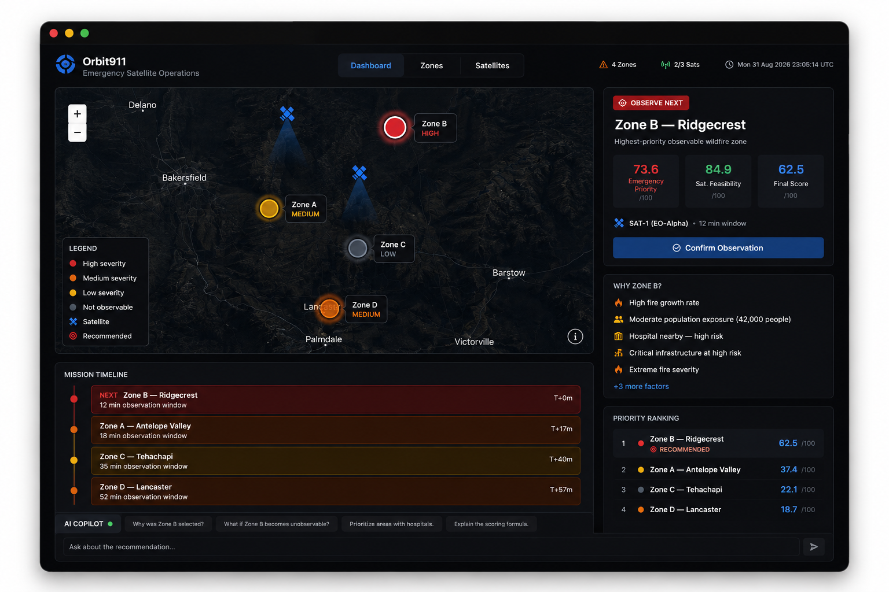

# Orbit911

> **Look where it matters most.**

Orbit911 is an AI-assisted decision-support system that helps emergency operations coordinators decide **which wildfire area should be observed next by an Earth-observation satellite—and why**.

During a fast-moving wildfire, operators must consider fire severity, population exposure, critical infrastructure, urgency, and satellite availability at the same time. Orbit911 combines these signals into an explainable observation recommendation.



---

## At a glance

| Section | Description |
| --- | --- |
| **What** | Helps emergency operators prioritize wildfire zones and determine the best next satellite observation target. |
| **Why it is different** | Combines a deterministic decision engine with an AI explanation layer instead of relying on AI to make authoritative decisions. |
| **Who it is for** | Emergency Operations Coordinators and disaster-response decision makers. |
| **Disaster scope** | Wildfire only for the MVP. |
| **Observation** | Recommends where the satellite should observe next. It does not control spacecraft. |
| **AI role** | Explains recommendations, interprets operator intent, and supports What-If scenarios. |
| **Built with** | Next.js · React · TypeScript · Tailwind CSS · shadcn/ui · MapLibre GL JS · Recharts · FastAPI · Python · SQLite · Google Gemini |

---

## The problem

During a rapidly evolving wildfire, multiple areas may require attention at the same time.

Emergency operators need to consider:

- Fire severity
- Fire growth
- Population exposure
- Hospital and critical infrastructure risk
- Urgency
- Satellite visibility
- Observation windows
- Satellite availability

These signals are difficult to prioritize manually, especially when satellite observation opportunities are limited.

The problem is not simply:

> **"Where is the fire?"**

It is:

> **"What should we look at next?"**

---

## The solution

Orbit911 acts as a **decision layer between disaster intelligence, satellite observation, and emergency decision-making**.

### Core decision loop

```text
WILDFIRE DATA
      ↓
PRIORITIZE
      ↓
CHECK SATELLITE FEASIBILITY
      ↓
RECOMMEND
      ↓
EXPLAIN
      ↓
WHAT-IF
      ↓
RECALCULATE
```

Orbit911 evaluates wildfire zones, checks whether they can currently be observed, ranks the available options, and recommends the highest-value observation target.

---

## How IBM Bob was used

IBM Bob was used as an AI development copilot throughout the project.

- **Planning:** Helped turn the PRD into a clear development plan and implementation steps.
- **Backend:** Assisted with FastAPI, database models, decision engine, APIs, and Gemini integration.
- **Frontend:** Assisted with building and integrating the Next.js dashboard.
- **UI/UX:** Used a custom **UI/UX design skill** in IBM Bob to guide a clean, user-friendly, and anti-slop interface.
- **Testing & Debugging:** Assisted in identifying and fixing development and integration issues.

IBM Bob supported the development process, while the product decisions and final implementation remained human-directed.

---

## How Orbit911 makes the decision

### 1. Emergency Priority

Each wildfire receives an explainable priority score based on:

| Factor | Weight |
| --- | ---: |
| Human Impact | 30% |
| Fire Severity | 25% |
| Urgency | 20% |
| Critical Infrastructure | 15% |
| Time Sensitivity | 10% |

All factors are normalized to **0–100**.

### 2. Satellite Feasibility

The system evaluates:

- Satellite visibility
- Observation window
- Satellite availability

### 3. Final Score

```text
Final Score =
Emergency Priority × Satellite Feasibility
```

The system then ranks all wildfire zones and recommends the highest-scoring feasible target.

The calculation is deterministic and transparent.

---

## AI-assisted decision support

AI sits **on top of the deterministic decision engine**.

### AI can

- Explain why a zone was selected
- Interpret natural-language operator preferences
- Support What-If scenarios
- Summarize decision results

For example:

> **"Why was Zone B selected?"**

or:

> **"What if Zone B becomes unobservable?"**

The AI converts relevant user intent into structured changes, while the deterministic engine remains the source of truth.

### AI must not

- Invent disaster data
- Calculate the authoritative priority score
- Override satellite constraints
- Fabricate satellite availability
- Control satellites
- Make autonomous emergency decisions

This separation keeps Orbit911 **explainable and human-controlled**.

---

## What-If simulation

Operators can change an important condition and recalculate the recommendation.

Example:

```text
Current recommendation
Zone B

        ↓

What if Zone B becomes unobservable?

        ↓

Recalculate

        ↓

Zone C becomes the best feasible target
```

The key behavior is:

> **Change → Recalculate → Explain**

---

## Main dashboard

Orbit911 uses a single operational dashboard designed for fast decision-making.

### Disaster Map

Displays:

- Wildfire zones
- Wildfire severity
- Recommended target
- Satellite position
- Population and infrastructure context

### Priority Ranking

Example:

```text
1. Zone B — 94
2. Zone A — 76
3. Zone C — 61
4. Zone D — 43
```

### Recommended Action

The dashboard clearly presents:

```text
OBSERVE ZONE B NEXT
```

along with:

- Emergency priority
- Satellite feasibility
- Final score
- Main reasons

### AI Assistant

Operators can ask questions about the current recommendation and explore What-If scenarios using natural language.

---

## Technical architecture

```text
                    ┌─────────────────────┐
                    │     Next.js UI      │
                    │  Dashboard + Map    │
                    └──────────┬──────────┘
                               │
                               ▼
                    ┌─────────────────────┐
                    │     FastAPI API     │
                    └──────────┬──────────┘
                               │
              ┌────────────────┴────────────────┐
              ▼                                 ▼
    ┌─────────────────────┐          ┌─────────────────────┐
    │ Deterministic Engine│          │     AI Layer        │
    │                     │          │     Gemini          │
    │ Priority            │          │                     │
    │ Feasibility         │          │ Explain             │
    │ Recommendation      │          │ Interpret           │
    └──────────┬──────────┘          │ What-If             │
               │                     └──────────┬──────────┘
               └────────────────┬───────────────┘
                                ▼
                         ┌─────────────┐
                         │   SQLite    │
                         │  Orbit911   │
                         └─────────────┘
```

### Architecture principles

- **Deterministic engine → Source of truth**
- **AI → Explanation and interaction layer**
- **Human operator → Final decision maker**

---

## Repository structure

```text
Orbit911/
├── app/
│   ├── ai/
│   ├── engine/
│   ├── models/
│   ├── routers/
│   ├── schemas/
│   ├── config.py
│   ├── database.py
│   └── main.py
│
├── frontend/
│   ├── app/
│   ├── components/
│   ├── data/
│   └── lib/
│
├── tests/
├── seed.py
├── requirements.txt
├── .env.example
└── README.md
```

---

## API

| Method | Endpoint | Description |
| --- | --- | --- |
| `GET` | `/api/wildfires` | Get all wildfire zones |
| `GET` | `/api/wildfires/{id}` | Get a single wildfire zone |
| `GET` | `/api/satellites` | Get all satellites |
| `GET` | `/api/satellites/{id}` | Get a single satellite |
| `GET` | `/api/recommendation` | Run the decision engine and return the ranked recommendation |
| `POST` | `/api/recommendation/recalculate` | Recalculate recommendation for What-If scenarios |
| `POST` | `/api/ai/chat` | Ask the AI assistant about the current decision |

---

## Local development

### Prerequisites

- Node.js
- npm
- Python 3.11+
- Google Gemini API key

### 1. Clone the repository

```bash
git clone <your-repository-url>
cd Orbit911
```

### 2. Backend setup

Create and activate a virtual environment:

```powershell
python -m venv .venv
.\.venv\Scripts\Activate.ps1
```

Install dependencies:

```powershell
pip install -r requirements.txt
```

Configure `.env`:

```env
APP_NAME=Orbit911
APP_VERSION=0.1.0
DEBUG=True

DATABASE_URL=sqlite:///./orbit911.db

GEMINI_API_KEY=your_gemini_api_key
GEMINI_MODEL=your_supported_gemini_model
```

Start FastAPI:

```powershell
python -m uvicorn app.main:app --reload
```

The backend runs at:

```text
http://localhost:8000
```

FastAPI documentation:

```text
http://localhost:8000/docs
```

### 3. Frontend setup

Open a second terminal:

```powershell
cd frontend
npm install
npm run dev
```

The frontend runs at:

```text
http://localhost:3000
```

---

## Prototype notice

Orbit911 is a hackathon prototype intended for demonstration, exploration, and decision-support research.

It is **not a certified emergency-response, satellite-control, or safety-critical system**. Its outputs should be independently verified before being used for real operational decisions.

---

## License

This project is provided for the purposes of the IBM AI Builders Challenge.
